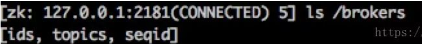

## Linux下安装JDK

* 进入/home/soft 目录 ，将jdk解压到/usr/java 注意：需提前在usr 目录下创建java目录

```
jdk-1.8.tar.gz文件包上传至/home/soft目录
cd /home/soft
tar -xvf jdk-1.8.tar.gz -C /usr/java
```

* 进入/usr/java 目录，确认jdk解压后的目录是否存在

* 打开vim 编辑器编辑/etc/profile 配置文件，进行jdk环境变量的配置。 vim /etc/profile 进入

  文档编辑状态

  按下：i键

  在源文件最后一行加入以下配置代码，注意JAVA_HOME 的路径为jdk解压后的目录

```
JAVA_HOME=/usr/java/jdk-1.8
CLASSPATH=.:$JAVA_HOME/lib.tools.jar
PATH=$JAVA_HOME/bin:$PATH
export JAVA_hOME CPASSPATH PATH
```

* 保存配置文件，重新加载 /etc/profile 配置文件，并测试jdk环境变量是否配置成功

```
source /etc/profile
java -version
```

## Linux下安装MySQL（5.7）

* 下载地址 https://dev.mysql.com/downloads/mysql/

* 安装包上传到/home/soft文件夹

* ```
  cd /home/soft
  tar -xvf mysql-5.7.tar.gz -C /home/soft/tmp => 解压到指定位置
  cd /home/soft/tmp
  mkdir -p /usr/local/mysql => 创建目录
  mv mysql-5.7.36-linux-glibc2.12-x86_64 /usr/local/mysql => 移动解压后的文件至/usr/local并重命名为mysql（必）
  ```
  
* ```
  cd /usr/local/mysql
  mkdir data => 创建data文件夹，用于存放数据
  ```
  
* ```
  groupadd mysql => 添加用户组
  useradd -g mysql mysql => 添加用户mysql到用户组mysql 
  id mysql
  ```

* ```
  cd /usr/local/mysql
  chown -R mysql:mysql /usr/local/mysql => 将安装目录所有者及所属组改为mysql
  ```

* ```
  cd /usr/local/mysql/bin
  yum install libaio
  ./mysqld --initialize --user=mysql --basedir=/usr/local/mysql --datadir=/usr/local/mysql/data => 初始化
  临时密码在datadir>mysqld.log中查看
  ```

* ```
  vim /etc/my.cnf => 编辑配置文件
  
  文件内容如下
  [mysqld]
  datadir=/usr/local/mysql/data
  basedir=/usr/local/mysql
  socket=/tmp/mysql.sock
  user=mysql
  port=3306
  character-set-server=utf8
  # 取消密码验证
  #skip-grant-tables
  # Disabling symbolic-links is recommended to prevent assorted security risks
  symbolic-links=0
  # skip-grant-tables
  [mysqld_safe]
  log-error=/usr/local/mysql/data/mysqld.log 
  pid-file=/usr/local/mysql/data/mysqld.pid
  
  # 添加下两项解决Can't connect to local MySQL server through socket
  [mysqld]
  socket=/var/lib/mysql/mysql.sock 
  [client]
  socket=/var/lib/mysql/mysql.sock
  ```
  
  
  
* ```
  cp /usr/local/mysql/support-files/mysql.server /etc/init.d/mysql => 将mysql加入到服务中
  cd /etc/init.d
  chkconfig mysql on => 设置开机启动
  service mysql start => 启动MySQL
  ```

* ```
  cd /usr/local/mysql/bin
  ./mysql -u root -p  => 登录MySQL
  输入之前记录的密码，或者之前设置了跳过密码验证，直接回车进入mysql
  ```

* ```
  SET PASSWORD = PASSWORD('root');  => 修改密码为root,执行指令需要带上；
  ALTER USER 'root'@'localhost' PASSWORD EXPIRE NEVER;
  FLUSH PRIVILEGES; 
  ```

* ```
  加入到环境变量配置文件中，实现通过 ： mysql -u root -p 登录
  vi /etc/profile
  一直往下找到之前加入的环境变量，在下方加入
  export MYSQL_HOME=/usr/local/mysql
  export PATH=$MYSQL_HOME/bin:$PATH
  退出保存
  source /etc/profile => 让修改后的环境变量配置文件生效
  ```

  

* ```
  netstat -ntpl => 查看网络的端口信息
  iptables -vnL
  iptables -F => 清除防火墙中链中的规则
  ```

* ```
  mysql -u root -p
  输入之前修改的密码	
  grant all privileges on *.* to 'root'@'%' identified by 'tzsw1234' with grant option;
  flush privileges;  => 允许远程登录
  ```


二次安装显示启动失败，初始化出问题。

安装路径  /home/mysql

## Linux下安装Nginx

### 安装编译工具及库文件

```
yum -y install make zlib zlib-devel gcc-c++ libtool  openssl openssl-devel
```

### 安装 PCRE

* 下载 PCRE 安装包，下载地址： http://downloads.sourceforge.net/project/pcre/pcre/8.35/pcre-8.35.tar.gz

* 或者使用命令行获取安装包 

  * ```
    cd /usr/local/src/
    wget http://downloads.sourceforge.net/project/pcre/pcre/8.35/pcre-8.35.tar.gz
    ```

* ```
  安装包上传到/usr/local/src/
  cd /usr/local/src/
  tar zxvf pcre-8.35.tar.gz => 解压安装包
  cd pcre-8.35
  ./configure
  make && make install => 编译安装
  pcre-config --version => 查看PCRE版本
  ```

### 安装NGINX

* 下载NGINX安装包，下载地址： https://nginx.org/en/download.html

* 或者使用命令行获取安装包

  * ```
    cd /usr/local/src/
    wget https://nginx.org/download/nginx-1.16.1.tar.gz
    ```

* ```
  安装包上传到/usr/local/src/
  cd /usr/local/src/
  tar zxvf nginx-1.6.2.tar.gz => 解压缩安装包
  ./configure --prefix=/usr/local/webserver/nginx --with-http_stub_status_module --with-http_ssl_module --with-pcre=/usr/local/src/pcre-8.35 => 编译安装
  make && make install => 编译安装
  /usr/local/webserver/nginx/sbin/nginx -v => 查看nginx版本
  nginx安装完成
  ```

### NGINX配置

* ```
  groupadd www => 创建组
  useradd -g www www => 创建用户
  ```

* ```
  vi /usr/local/webserver/nginx/conf/nginx.conf => 配置nginx.conf,将nginx.conf替换为以下内容
  ```

  * ```
    user www www;
    worker_processes 2; #设置值和CPU核心数一致
    error_log /usr/local/webserver/nginx/logs/nginx_error.log crit; #日志位置和日志级别
    pid /usr/local/webserver/nginx/nginx.pid;
    #Specifies the value for maximum file descriptors that can be opened by this process.
    worker_rlimit_nofile 65535;
    events
    {
      use epoll;
      worker_connections 65535;
    }
    http
    {
      include mime.types;
      default_type application/octet-stream;
      log_format main  '$remote_addr - $remote_user [$time_local] "$request" '
                   '$status $body_bytes_sent "$http_referer" '
                   '"$http_user_agent" $http_x_forwarded_for';
      
    #charset gb2312;
         
      server_names_hash_bucket_size 128;
      client_header_buffer_size 32k;
      large_client_header_buffers 4 32k;
      client_max_body_size 8m;
         
      sendfile on;
      tcp_nopush on;
      keepalive_timeout 60;
      tcp_nodelay on;
      fastcgi_connect_timeout 300;
      fastcgi_send_timeout 300;
      fastcgi_read_timeout 300;
      fastcgi_buffer_size 64k;
      fastcgi_buffers 4 64k;
      fastcgi_busy_buffers_size 128k;
      fastcgi_temp_file_write_size 128k;
      gzip on; 
      gzip_min_length 1k;
      gzip_buffers 4 16k;
      gzip_http_version 1.0;
      gzip_comp_level 2;
      gzip_types text/plain application/x-javascript text/css application/xml;
      gzip_vary on;
     
      #limit_zone crawler $binary_remote_addr 10m;
     #下面是server虚拟主机的配置
     server
      {
        listen 80;#监听端口
        server_name localhost;#域名
        index index.html index.htm index.php;
        root /usr/local/webserver/nginx/html;#站点目录
          location ~ .*\.(php|php5)?$
        {
          #fastcgi_pass unix:/tmp/php-cgi.sock;
          fastcgi_pass 127.0.0.1:9000;
          fastcgi_index index.php;
          include fastcgi.conf;
        }
        location ~ .*\.(gif|jpg|jpeg|png|bmp|swf|ico)$
        {
          expires 30d;
      # access_log off;
        }
        location ~ .*\.(js|css)?$
        {
          expires 15d;
       # access_log off;
        }
        access_log off;
      }
    
    }
    ```

* ```
  /usr/local/webserver/nginx/sbin/nginx -t => 检查配置文件nginx.conf的正确性命令
  ```

* ```
  /usr/local/webserver/nginx/sbin/nginx => 启动NGINX
  ```

### NGINX命令

```
/usr/local/webserver/nginx/sbin/nginx -s reload            # 重新载入配置文件
/usr/local/webserver/nginx/sbin/nginx -s reopen            # 重启 Nginx
/usr/local/webserver/nginx/sbin/nginx -s stop              # 停止 Nginx
```

## Linux下安装Redis

* 下载地址 https://redis.io/download

* ```
  安装包上传到 /usr/local/redis
  tar xzvf redis-4.0.8.tar.gz   => 解压
  cd redis-4.0.8 
  make =>编译
  cd src
  make install PREFIX=/usr/local/redis
  cd ../ 
  mkdir /usr/local/redis/etc 
  mv redis.conf /usr/local/redis/etc => 移动配置文件到安装目录下
  vi /usr/local/redis/etc/redis.conf => 将daemonize no 改成daemonize yes,配置redis为后台启动
  => 设置密码，requirepass tzsw1234
  => bind 127.0.0.1前面加#注释掉 => 让reids监听外网的请求
  vi /etc/rc.local
  添加 /usr/local/redis/bin/redis-server /usr/local/redis/etc/redis.conf => 将redis加入到开机启动
  /usr/local/redis/bin/redis-server /usr/local/redis/etc/redis.conf => 开启redis
  
  cp /usr/local/redis/bin/redis-server /usr/local/bin/
  cp /usr/local/redis/bin/redis-cli /usr/local/bin/  => 将redis-cli,redis-server拷贝到bin下，让redis-cli指令可以在任意目录下直接使用
  * 让外网能够访问redis
  firewall-cmd --zone=public --add-port=6379/tcp --permanent（开放6379端口） => 配置防火墙
  systemctl restart firewalld => 重启防火墙以使配置即时生效
  firewall-cmd --zone=public --list-ports => 查看系统所有开放的端口
  * 此时 虽然防火墙开放了6379端口，但是外网还是无法访问的，因为redis监听的是127.0.0.1：6379，并不监听外网的请求。
  
  ```

* 其他命令

  ```
  redis-cli
  config get requirepass => 获取密码
  config set requirepass => 设置密码
  config get daemonized 
  ```


## Linux下安装Zookeeper

* zookeeper官网 https://zookeeper.apache.org/releases.html#download 

* 上传文件到/home/temp目录，创建文件夹/home/zookeeper

* 改名 mv apache-zookeeper-3.5.5-bin.tar.gz zookeeper-3.5.5.tar.gz

* 解压压缩包到/usr/local/zookeeper目录下
  tar -zxvf zookeeper-3.4.6.tar. gz -C /usr/local/zookeeper

* 安装目录下创建 data 、 logs 文件夹

* 修改配置文件，zoo.cfg可能叫zoo_sample.cfg，把zoo_sample.cfg改成zoo.cfg即可

  ```
  vi conf/zoo.cfg
  添加配置
  #dataDir自定义路径参数
  dataDir=/home/zookeeper/apache-zookeeper-3.8.0-bin/data
  ```

* 启动ZooKeeper，在/home/zookeeper/apache-zookeeper-3.8.0-bin目录下使用命令 bin/zkServer.sh start

* jps或者jps-m 查看zookeeper启动的进程信息

  ```
  重启zookeeper => bin/zkServer.sh start
  停止zookeeper => bin/zkServer.sh stop
  启动zookeeper客户端 => bin/zkCli.sh
  ```


## Linux下安装kafka

参考教程

```
https://mp.weixin.qq.com/s?__biz=MzU3MzgwNTU2Mg==&mid=100000470&idx=1&sn=41ee111a073c51af4f9e87c2cdc4d584&chksm=7d3d44434a4acd55b67414765a7b79152d7ef430ba00bec8af6cdddd8e8cf161777ee4a15841#rd
```

* 修改kafka的配置文件

  ```
  进入kafka根目录下的config文件夹下，打开server.properties,修改如下配置
  
  zookeeper.connect=localhost:2181
  
  broker.id=0
  
  log.dirs=/tmp/kafka-logs
  
  zookeeper.connect是zookeeper的链接信息，broker.id是当前kafka实例的id，log.dirs是kafka存储消息内容的路径。
  ```

* 启动kafka

  ```
  进入kafka根目录执行
  nohup bin/zookeeper-server-start.sh ../config/zookeeper.properties >>/tmp/zk-logs/zk.log 2>&1 &
  nohup bin/kafka-server-start.sh config/server.properties >>/tmp/kafka-logs/kafka.log 2>&1 &
  
  查看是否启动成功
  netstat -anlpt | grep 2181 ->查看zookeeper启动成功
  netstat -anlpt | grep 9092 ->查看kafka启动成功
  ```

* 确认kafka启动成功

  * 启动zookeeper的client

    ```
    进入zookeeper根目录下，执行 bin/zkCli.sh -server 127.0.0.1:2181。启动成功后如下图
    
    ```

    

  * 输入命令 ls /brokers，回车，可以看到如下信息：

​				


